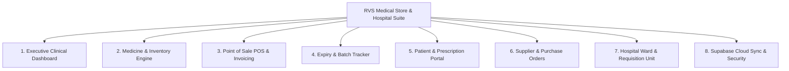

# RVS Medical Store & Hospital Management System - Master Plan

A comprehensive, end-to-end management web application tailored for **RVS Medical Store & Hospital Pharmacy**, featuring real-time inventory tracking, smart POS billing, expiry monitoring, doctor/patient prescription management, supplier logistics, and seamless **Supabase** cloud backend integration.

---

## 🏥 Design Theme & Visual Identity (Hospital & Clinical Grade)

| Element | Specification / Palette |
| :--- | :--- |
| **Primary Theme** | Clean Clinical Light & Deep Midnight Hospital Dark mode |
| **Primary Brand Colors** | Medical Teal (`#0D9488`), Pulse Cyan (`#0284C7`), Deep Navy (`#0F172A`) |
| **Status Accents** | Safe/In-Stock Mint (`#10B981`), Warning/Expiring Amber (`#F59E0B`), Emergency/Critical Red (`#EF4444`) |
| **Surface Styling** | High-gloss clinical glassmorphism, soft pill badges, backdrop blur, rounded card layouts |
| **Typography & Icons** | Modern typography (Inter / Plus Jakarta Sans) + Medical Lucide iconography (pills, syringe, heartbeat, clipboard, barcode) |

---

## 🌟 Core System Modules & Features



### 1. 📊 Executive Dashboard & Live Analytics
- **Live KPI Counters**: Today's Sales, Total Profit/Margin, Medicines In Stock, Low-Stock Warnings, Expiring Soon Count (<30/60 days).
- **Interactive Visual Charts**: Daily & Monthly revenue velocity, fastest-selling categories (Antibiotics, Analgesics, Cardiac, etc.).
- **Quick Action Bar**: Fast Billing, Add Stock, Add Patient Prescription, Scan Barcode.

### 2. 💊 Smart Medicine & Inventory Management
- **Medicine Database**: Generic name, Brand name, Dosage form (Tablet, Syrup, Injection, Ointment, IV), Category, Manufacturer, Unit cost, MRP, Shelf/Rack ID.
- **Batch & Strip/Unit Conversion**: Multi-batch tracking (different expiry dates and costs per batch).
- **Automated Stock Alerts**: Real-time indicators when stock dips below safe thresholds.
- **Search & Filter**: Instant generic search with chemical compound lookup.

### 3. 🧾 Fast POS Billing & Thermal/PDF Invoice Generation
- **Speed-Billing Keyboard Shortcuts & Barcode Scanner integration**.
- **Customer & Patient Tagging**: Walk-in customer or In-patient/OPD hospital ID.
- **GST / Tax & Discount Engine**: Automatic CGST/SGST/IGST breakdown with configurable discount presets.
- **Multiple Payment Modes**: Cash, UPI/QR Code, Credit/Debit Card, Split Payment.
- **Printable Invoices**: Clean, branded **RVS Medical Store & Hospital** receipts formatted for A4 & 80mm/58mm thermal printers.

### 4. ⏳ Expiry Date & Wastage Monitor
- **Categorized Expiry Timeline**: Expired (Red Alert), Expiring in <30 Days (Orange Alert), Expiring in <90 Days (Yellow Alert).
- **Return to Vendor / Disposal Log**: Track damaged or recalled batches with credit note generation.

### 5. 🩺 Patients & Prescription Hub
- **Patient Profile**: Name, Phone, Age, Blood Group, Doctor Name, Allergies, Medical History.
- **Digital Prescription Upload / Reader**: Attach prescription images or create digital itemized orders.
- **Refill Reminders**: List chronic patients (Diabetes, BP) due for medicine refills.

### 6. 🚚 Suppliers & Purchase Order (PO) Management
- **Supplier Directory**: Contact info, GSTIN, payment terms, outstanding balances.
- **PO Creation & Inward Stock Entry**: Log supplier invoices, auto-update stock quantities and batch costs.

### 7. 🏥 Hospital Department & Ward Requisitions (Hospital-Ready)
- **Ward/ICU/OT Drug Issue**: Issue emergency medicine packs to hospital departments with charge-to-bed logging.

---

## 🗄️ Supabase Cloud Database Architecture

The backend will run on **Supabase** (PostgreSQL) with Row-Level Security (RLS) and real-time syncing:

```
├── medicines           (id, name, generic_name, category, dosage_form, manufacturer, shelf_location, min_stock_alert)
├── medicine_batches    (id, medicine_id, batch_no, expiry_date, cost_price, mrp, selling_price, current_stock)
├── sales_invoices      (id, invoice_number, patient_id, customer_name, customer_phone, total_amount, discount, tax, payment_mode, status, created_at)
├── sales_items         (id, invoice_id, batch_id, quantity, unit_price, total_price)
├── suppliers           (id, name, company_name, phone, email, gstin, address)
├── purchase_orders     (id, po_number, supplier_id, total_amount, status, created_at)
├── purchase_items      (id, po_id, medicine_id, batch_no, expiry_date, quantity, cost_price)
├── patients            (id, patient_uhid, full_name, phone, age, gender, doctor_name)
└── stock_logs          (id, batch_id, change_type, quantity, notes, created_at)
```

---

## 🔑 Supabase Credentials Setup Guide (What we need & How to get them)

To connect your application directly with Supabase, we only need **2 keys**:

### 1. Required Keys
1. **`SUPABASE_URL`** (Project URL)  
   *Example: `https://xyzcompanyabcdef.supabase.co`*
2. **`SUPABASE_ANON_KEY`** (Public Anonymous API Key)  
   *Example: `eyJhbGciOi...` (long alphanumeric token safe for web apps)*

> [!NOTE]
> We **DO NOT** need your `SERVICE_ROLE_KEY` (secret key). The `anon` key is safe and designed for browser/client-side apps with Row Level Security.

---

### 2. Step-by-Step Instructions to Get Supabase Keys

1. **Create/Log in to Supabase**:
   - Visit [supabase.com](https://supabase.com) and click **"Start your project"** or **Sign in with GitHub/Email**.

2. **Create a New Project**:
   - Click **"+ New Project"**.
   - Select your organization.
   - Enter **Project Name**: `rvs-medical-store`.
   - Set a strong **Database Password** (save this somewhere safe).
   - Choose a **Region** nearest to you (e.g., `South Asia (Mumbai)` or closest region).
   - Click **"Create new project"** (takes ~1 minute to spin up).

3. **Copy the Keys from Project Settings**:
   - In your project dashboard, click the ⚙️ **Project Settings** icon (bottom of the left sidebar).
   - Navigate to the **"API"** tab under Configuration.
   - You will see:
     - **Project URL** (under URL) ➔ Copy this as `SUPABASE_URL`.
     - **Project API Keys** ➔ Look for the key labeled `anon` / `public` ➔ Copy this as `SUPABASE_ANON_KEY`.

4. **Run the Database Tables Setup**:
   - We will provide a 1-click SQL setup script that you can paste directly into Supabase's **SQL Editor** tab to create all tables, indexes, and demo hospital data in 5 seconds!

---

## 🛠️ Technology Stack & Execution Plan

- **Frontend**: Single-Page App with responsive UI, Tailwind/Vanilla CSS clinical glassmorphic design, Lucide icons, and Charting.
- **Backend / Realtime Sync**: Supabase JavaScript Client (`@supabase/supabase-js`), PostgreSQL with real-time websocket listeners.
- **Local Fallback / Demo Mode**: Built-in mock data fallback so the entire app can be tested immediately even before putting in Supabase keys!

---

## 🚀 Execution Phases

1. **Phase 1: Architecture & UI Component Framework** (Design tokens, Medical Navigation, Dark/Light Mode, Header with Quick Action Bar).
2. **Phase 2: Supabase Integration & Schema Migration Script** (Connecting database client, error handling, offline/online indicator).
3. **Phase 3: Inventory & Expiry Management Module** (Medicine master, batching, expiry alerts, low stock badges).
4. **Phase 4: High-Speed POS Billing & Clinical Invoice System** (Cart, tax calculation, payment modal, printable receipt).
5. **Phase 5: Patients, Prescriptions & Supplier Purchasing** (Patient log, supplier POs, refill alerts).
6. **Phase 6: End-to-End Testing & Verification**.
